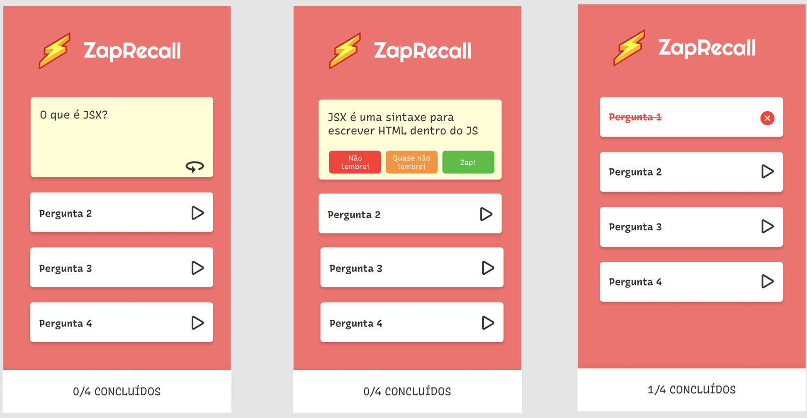

<h1 align="center">Zap Recall - ReactJS </h1>

✅ Requisitos
- Geral
    - [x]  Manipule o HTML usando somente React (sem usar o document, nem o localStorage, ****nem bibliotecas React, JavaScript e/ou CSS).
    - [x]  Todo o armazenamento de informações deve ser feito via estados.
    - [x]  Seu projeto deverá ser desenvolvido utilizando Git e GitHub.
    - [x]  A cada requisito implementado faça um *commit* com uma mensagem descritiva do que você evoluiu. Caso queira dividir um requisito em vários *commits*, não há problema. Mas evite colocar mais de um requisito no mesmo *commit*.
    - [x]  Nesse projeto, a estilização deve ser feita com styled-components obrigatoriamente.
    - [x]  O *deploy* da aplicação utilizando Vercel também é obrigatório.
    - [x]  *Não é permitido o uso de `Context` nem de `Router`!*
    
- *Layout*
    - [x]  Aplicar *layout* seguindo o Figma.
    - [x]  Você pode usar o *deck* que desejar, temos aqui o exemplo de um *deck* sobre React:
        1. **Q:** O que é JSX? **R:** Uma extensão de linguagem do JavaScript
        2. **Q:** O React é __ **R:** uma biblioteca JavaScript para construção de interfaces
        3. **Q:** Componentes devem iniciar com __ **R:** letra maiúscula
        4. **Q:** Podemos colocar __ dentro do JSX **R:** expressões
        5. **Q:** O ReactDOM nos ajuda __ **R:** interagindo com a DOM para colocar componentes React na mesma
        6. **Q:** Usamos o npm para __ **R:** gerenciar os pacotes necessários e suas dependências
        7. **Q:** Usamos props para __ **R:** passar diferentes informações para componentes 
        8. **Q:** Usamos estado (state) para __ **R:** dizer para o React quais informações quando atualizadas devem renderizar a tela novamente
        - Em formato de objeto
            
            ```jsx
            const cards = [
            	{ question: "O que é JSX?", answer: "Uma extensão da linguagem JavaScript" },
            	{ question: "O React é __", answer: "Uma biblioteca JavaScript para construção de interfaces" },
            	{ question: "Componentes devem iniciar com __", answer: "Letra maiúscula" },
            	{ question: "Podemos colocar __ dentro do JSX", answer: "expressões" },
            	{ question: "O ReactDOM nos ajuda __", answer: "Interagindo com a DOM para colocar componentes React na mesma" },
            	{ question: "Usamos o npm para __", answer: "Gerenciar os pacotes necessários e suas dependências" },
            	{ question: "Usamos props para __", answer: "Passar diferentes informações para componentes" },
            	{ question: "Usamos estado (state) para __", answer: "Dizer para o React quais informações quando atualizadas devem renderizar a tela novamente" }
            ]
            ```
            
    - [x]  Use as fontes indicadas no Layout do Figma.
- Componentização e dados
    - [x]  Os elementos da página devem ser componentizados com React em arquivos separados.
    - [x]  Os dados dinâmicos da página (como o *deck*, *flashcards*, etc) devem ser representados como *arrays* ou objetos no JavaScript e renderizados na tela.
- *Flashcards*
    - [x]  Todos os *flashcards* devem aparecer na tela virados e indexados por números (ex: Pergunta 1, Pergunta 2), de modo a “esconder” o termo ou pergunta que ele contém.
    - [x]  Ao clicar na setinha de “play” de um *flashcard*, a pergunta ou termo correspondente ao *flashcard* deve aparecer (não é necessária nenhuma animação).
    - [x]  Para ver a resposta do *flashcard*, o usuário deve clicar no ícone de “virar” (o componente é o mesmo, apenas teve seu *layout* adaptado).
        - Ao virar um *flashcard*...
            - [x]  O usuário deve visualizar a resposta correta para a pergunta e os três botões (Não lembrei, Quase não lembrei ou Zap).
            - [x]  Ao clicar em qualquer um dos botões, o *flashcard* deverá ser dado como respondido e terá seu status alterado para refletir a escolha do usuário:
                - *Flashcard* incorreto (Não lembrei)
                - *Flashcard* correto com esforço (Quase não lembrei)
                - *Flashcard* correto imediatamente (Zap!)
            - [x]  Depois de respondida, a pergunta deverá ficar fechada e seu texto tachado com a cor correta correspondente ao seu status e um ícone. Ela não poderá ser aberta novamente.
- Contador de conclusão
    - [x]  O contador deve mostrar quantas perguntas o usuário já respondeu e quantas perguntas há no total.
    - [x]  Sempre que uma carta for respondida (clique nos botões), o número de flashcards respondidos deve ser atualizado.
    - [x]  O número de flashcards respondidos nunca pode ser maior do que o número total.
- *Deploy*
    - Ao terminar o projeto, você obrigatoriamente deverá realizar o *deploy* utilizando a Vercel.
<hr/>

## 🛠 &nbsp;Skills
<div align="center">
  
  
  
  
          
  
                                     
</div>
<hr/>

## 🚀 &nbsp;Links

- [Figma](https://www.figma.com/file/PNYkKkFBAE1jRctvHoh7ix/ZapRecall?node-id=0%3A1&t=3qVpAf4RvpgOUvKP-0).<br/>
- [Deploy](https://projeto9-zaprecall-plum-six.vercel.app/).<br/>

<hr/>

## 💬 &nbsp;Contact


Feito por [Raissa Curty](https://github.com/curtyraissa)!

<a href="https://www.linkedin.com/in/raissa-curty/" target="_blank">
    
  </a>&nbsp;
